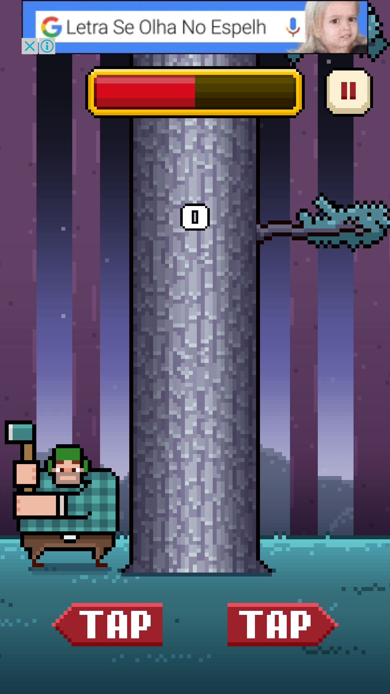
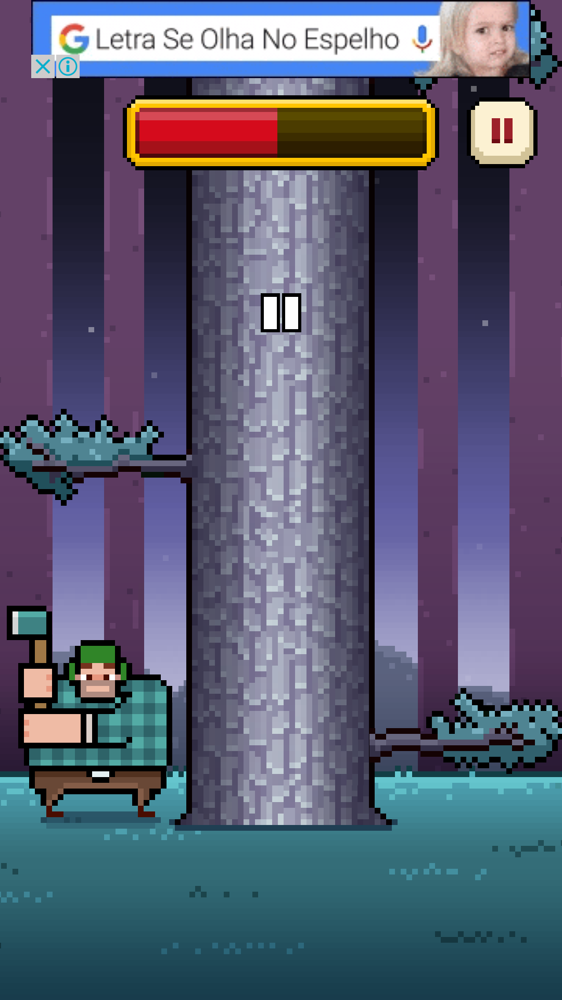

#Grupo
José Matheus, Matheus Stutzel, Rodrigo Braga 

#Projeto
Programar uma versão do jogo Timberman do Android no arduino. 

#Componentes
Arduino 
Tela com botões 

#Linguagem
Ceu 

#Detalhes do projeto
A cada momento o jogador deve cortar a “árvore” escolhendo um dos lados, eventualmente um dos lados estará bloqueado por um galho. Os pontos são obtidos à medida que o usuário corta a árvore.  
O jogo acaba se o usuário for acertado por um galho ou se o tempo acabar. O jogador ganha mais tempo ao cortar a árvore, de acordo com o nível atual. 

#Imagens do jogo original

